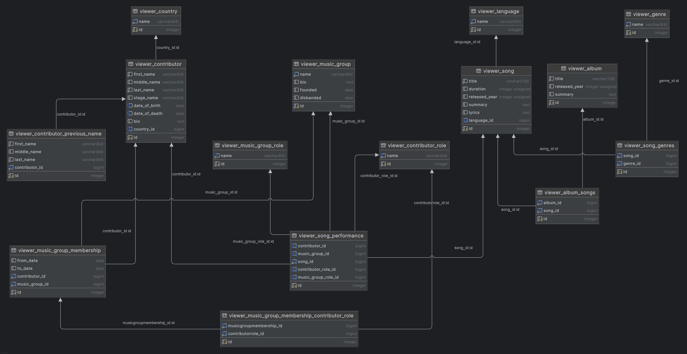

# MusicLibrary 
Final_project_SDA_2025 

- A complete full-stack application in Django for managing your personal music archive. 
- Users can catalog songs, albums, artists, and genres; upload album artwork; 
  and conveniently manage the library through a user-friendly web interface with login 
  and permissions.

Backend             Django 5, Python 3.13 
Database            SQLite 3 (development)
Frontend            Django Templates, Bootstrap 5, HTMX
Authentication      Django auth + accounts 
Development & CI    Git, GitHub Actions (lint + tests), PyCharm

## PROJECT Functionality 
- [ ] 1. Songs – listing
    - [x] Alphabetical list
    - [ ] Filtering by: genre, country, language, year, album, performer, ratings
- [ ] 2. Songs – song detail
    - [X] Title
    - [X] Genres (n:m -> Genre)
    - [X] Duration (in seconds)
    - [X] Release year
    - [X] Language
    - [X] Lyrics
    - [X] Summary / note
    - [X] Performers: individuals or groups (from SongPerformance)
    - [X] Performer roles (singer, composer, lyricist, etc.)
- [ ] 2.1. Songs – other
    - [ ] Album image (via Album relation)
    - [ ] Rating (user-based)
    - [ ] Audio sample / streaming link
- [ ] 3. Albums – listing and detail
    - [X] 3.1 Alphabetical album list
    - [X] 3.2 Album details (derived from songs)
        - [X] Title
        - [X] Ordered list of songs
        - [X] Genres
        - [X] Released year
        - [X] Total duration
        - [X] Languages
        - [X] Contributors list (performers, writers, producers)
- [ ] 4. Contributors – listing and detail
    - [x] 4.1. Alphabetical list
    - [x] 4.2. Contributor detail (singer, composer...)
        - [x] First name, last name, stage name
        - [x] Date of birth and death
        - [x] Country of origin
        - [x] Biography
        - [x] Previous names
        - [x] Songs performed (from SongPerformance)
        - [ ] Groups they were members of (MusicGroupMembership)
        - [ ] Picture 
- [ ] 5. Music Groups – listing and detail
    - [X] 5.1. Alphabetical list
    - [ ] 5.2. Group detail
        - [X] Name
        - [X] Bio
        - [X] Founded / disbanded year
        - [X] Members, roles
        - [ ] Members active periods
        - [X] Albums they performed in
        - [ ] Songs they performed in
- [ ] 6. Countries – listing and detail
    - [x] 6.1. Alphabetical list
    - [x] 6.2. Detail (list of contributors from the given country)
- [ ] 7. Genres – listing and detail
    - [x] 7.1. Alphabetical list
    - [x] 7.2. Detail (list of songs of the given genre)
- [ ] 8. CRUD operations (via admin or views): 
    - [ ] 8.1. Create
        - [ ] Songs, Contributors, Albums, Countries, Genres
    - [ ] 8.2 Update
        - [ ] Songs, Contributors, Albums, Countries, Genres
    - [ ] 8.3. Delete
        - [ ] Songs, Contributors, Albums, Countries, Genres
- [ ] 9. Authentication and Users
    - [ ] Display of logged-in user
    - [ ] Access restrictions by user type (regular vs. admin)
    - [ ] Login / Logout / Password reset
    - [ ] Registration, user profile
- [ ] 10. Authorization
    - [ ] Permissions for CRUD operations
    - [ ] Protection of specific views (e.g. admin only)

#### Databáze

- [x] Genre  
  - [x] name (String)
- [x] Country  
  - [x] name (String)
- [x] Language  
  - [x] name (String)
- [x] Contributor  
  - [x] first_name (String)  
  - [x] middle_name (String)  
  - [x] last_name (String)  
  - [x] stage_name (String)  
  - [x] date_of_birth (Date)  
  - [x] date_of_death (Date)  
  - [x] country (FK -> Country)  
  - [x] bio (Text)
- [x] ContributorPreviousName  
  - [x] contributor (FK -> Contributor)  
  - [x] first_name (String)  
  - [x] middle_name (String)  
  - [x] last_name (String)
- [x] ContributorRole  
  - [x] name (String)
- [x] MusicGroupRole  
  - [x] name (String)
- [x] MusicGroup  
  - [x] name (String)  
  - [x] bio (Text)  
  - [x] founded (Date)  
  - [x] disbanded (Date)
- [x] MusicGroupMembership  
  - [x] contributor (FK -> Contributor)  
  - [x] music_group (FK -> MusicGroup)  
  - [x] contributor_role (n:m -> ContributorRole)  
  - [x] from_date (Date)  
  - [x] to_date (Date)
- [x] Song  
  - [x] title (String)  
  - [x] genres (n:m -> Genre)  
  - [x] duration (Integer, in seconds)  
  - [x] released_year (Integer)  
  - [x] summary (Text)  
  - [x] lyrics (Text)  
  - [x] language (FK -> Language)
- [x] SongPerformance  
  - [x] song (FK -> Song)  
  - [x] contributor (FK -> Contributor)  
  - [x] contributor_role (FK -> ContributorRole)  
  - [x] music_group (FK -> MusicGroup) 
  - [x] music_group_role (FK -> MusicGroupRole)
- [x] Album  
  - [x] title (String)  
  - [x] songs (n:m -> Song)  
  - [x] released_year (Integer)  
  - [x] summary (Text)  

