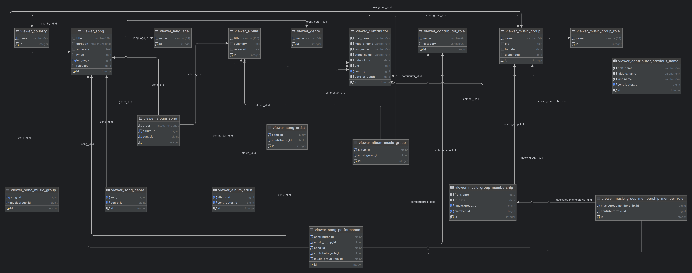

# MusicLibrary 

Final_project_SDA_2025: 

MusicLibrary is a collaborative web application for music database management. 
MusicLibrary allows users to manage a music database with information about songs, 
albums, contributors, and music groups. The app provides intuitive browsing, searching, 
and user account management, emphasizing clean design and responsive layout. 

- A complete full-stack application in Django for managing your personal music archive 
- Users can catalog songs, albums, artists, and genres; upload album artwork; 
  and conveniently manage the library through a user-friendly web interface with login 
  and permissions 
- run "python copy_covers.py" to create media/album_covers with actual images 

## Main functions 

- Browse lists of songs, albums, contributors and music groups
- View detailed information for each item 
- Search for songs by title 
- Manage user accounts (registration, login, password change) 
- Overview and management of genres, countries, languages and contributor roles 
- Responsive design optimized for desktop and mobile devices 

## Technology 

- Backend: Django (Python) 
- Frontend: HTML, Bootstrap 5, JavaScript 
- Database: SQLite (development), easily switchable to PostgreSQL for production 
- Templates: Django Templates 

## Installation and start-up 

1. Clone the repository: 
 ```bash
 git clone https://github.com/tvuj-username/musiclibrary.git
 cd musiclibrary
 ```
2. Create and activate a virtual environment: 
```bash
python -m venv venv
source venv/bin/activate  # on Windows use `venv\Scripts\activate`
```
3. Install the dependencies: 
```bash
pip install -r requirements.txt
```
4. Apply database migrations: 
```bash
python manage.py migrate
```
5. Install the dependencies: 
```bash
pip install -r requirements.txt
```
6. Start the development server: 
```bash
python manage.py runserver
```
7. Open the browser at: 
```bash
http://127.0.0.1:8000/
```

## Project structure

- musiclibrary/ - main Django application 
- templates/ - HTML templates 
- static/ - static files (CSS, JS, images) 
- musiclibrary/settings.py - project settings 
- musiclibrary/urls.py - URL routing 
- musiclibrary/views.py - request processing and logic 
- musiclibrary/models.py - data model definitions 

## Project Functionality

- [X] Bootstrap layout & styling, responsive navbar, home screen  
- [X] Songs: listing with filtering, sorting, pagination  
- [X] Albums: listing and detailed view  
- [X] Contributors & Music Groups: listing and detail  
- [X] Countries, Genres management  
- [X] User authentication, login modal, password reset  
- [X] API search endpoint  

(See the full feature checklist in project documentation.)

## Entity-Relationship (ER) Diagram 
The ER diagram represents the core data model of MusicLibrary, highlighting 
the relationships between key entities:

- Song: Represents a single music track, linked to albums and contributors.
- Album: A collection of songs, may have cover images and release info.
- Contributor: Artists, writers, producers, and others involved in music creation.
- ContributorRole: Defines roles a contributor can have on a song or album (e.g., performer, writer).
- MusicGroup: Represents bands or music groups consisting of multiple contributors.
- Genre, Country, Language: Metadata used to categorize songs and contributors.

The ER diagram image is located in the docs directory. You can update or 
regenerate it using your favorite diagram tool.

#### Database (ER Diagram)  


## Contribution Guidelines
Contributions are welcome! Please follow these steps:
If you would like to contribute to the project, please do the following:

1. Fork the repository 
2. Create a new feature branch (git checkout -b feature/feature-name) 
3. Commit your changes with meaningful messages (git commit -m 'New feature added') 
4. Push to branch (git push origin feature/feature-name) 
5. Create a pull request 

## License
This project is licensed under the MIT license. More info in the LICENSE file.

## Contact
If you have any questions or comments, please contact me by email: tvuj-email@example.com

### Thank you for exploring MusicLibrary — your showcase project for web development with Python! 🎵

